# IchigoJam用画像コンバータ
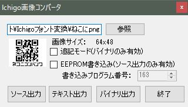  

## 概要
画像ファイルをIchigoJamの疑似グラフィック表示プログラムに変換するツールです.  
MS Windows 7/8/8.1/10環境で利用出来ます.  
画像ファイルはJPG,GIF,BMP,PNGに対応しています(BMP推奨).  

**実行例**  
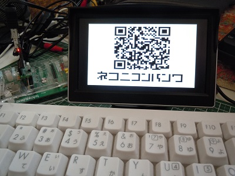  
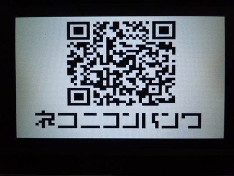  

## 利用環境
- 対応OS Windows 7/8/8.1/10  
- .NET Framework4以降のランタイムモジュール  

※別途 IchigoJam(ファームウェア1.2.1以降)利用環境が必要です.  

## 対応する画像ファイル
- PG,GIF,BMP,PNG  
- のモノクロ2色  
- 横64ドットx縦48ドット以下  

## インストール
フォルダbin内のファイルを各自のプログラム配置用フォルダに配置して下さい.  
フォルダbinには次のファイルが格納されています.  
- chigoBmpConv.exe ツール本体
- README.txt 簡易説明書
- qr_code.png サンプル画像ファイル
- sample.bas EEPROMに保存した画像表示サンプルプログラム
- output.bas 変換したプログラムソース例

## ツールの操作説明
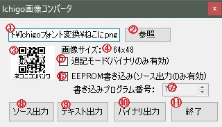  
(1) **画像ファイルパス**  
　 直接入力可能です.その場合は[Enter]キーで入力確定します.  
(2) **[参照]ボタン**  
　 ファイル選択ダイアログ画面を開いて画像選択を行います.  
(3)**画像プレビュー**  
　 変換対象の画像を表示します.  
(4)**画像サイズ**  
　 変換対象の画像のサイズを表示します.  
(5)**追記モードチェックボックス**  
　 [バイナリ出力]時のオプション指定として利用します.  
　 チェックを有効にすると、ファイル書き込み時に追記書込みモードで書き込みを行います.  
(6)**EEPROM書込みチェックボックス**    
　 [ソース出力]時のオプション指定として利用します.  
　 チェックを有効にするとEEPROM書き込み用のプログラムソースを出力します.  
(7)**書込みプログラム番号**  
　 [ソース出力]時のオプション指定として利用します.  
　 EEPROM書込みチェックボックスを有効にした場合にのみ設定可能です.  
　 EEPROMの書込み位置をしてプログラム番号を指定します.  
(8)**[ソース出力]ボタン**  
　 選択した画像の変換プログラムソースを出力します.  
　 保存先を指定するダイアログ画面が表示され、保存先を指定して出力します.  
(9)**[テキスト出力]ボタン**  
　 16進形式のテキストファイルを出力します.  
(10)**[バイナリ出力]ボタン**  
　 16進形式のバイナリファイルを出力します.  
(11)**[終了]ボタン**  
　 プログラムを終了します.  
その他  
　 画像ファイルの指定はドラック＆ドロップ操作も可能です.  
　 エクスプローラーからの画像ファイルをドラックして、ツール画面上にドロップします.  
  

## 機能説明
画像ファイルをIchigoJamの疑似グラフィック用文字列データに変換します.  
 **擬似グラフィック用文字(0x80～0x8f)**  
 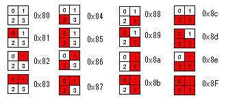  

変換したデータは次の形式での出力が可能です.  
- グラフィック表示プログラムソース  
- EEPROM書き込みプログラムソース  
- 16進データ  
- 16進データバイナリデータ  

下記のサンプル画像を変換した場合の各出力結果を示します.  
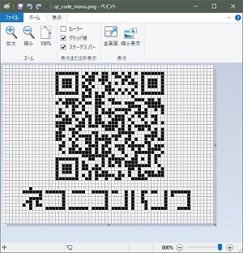  

**グラフィック表示プログラムソース**  
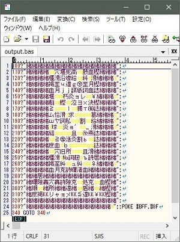  
出力されるプログラムソースは疑似フォント文字をPRINT命令(省略命令?を利用)で  
表示する単純なプログラムです.  
実行すると画面に画像を表示し、340行にて無限ループします.  
実行を中止する場合は、[ESC]キーを押します.  

**(注意)**Windows上でプログラムソースを開いた場合、IchigoJamの疑似フォント用文字は正しく表示出来ません.  

**EEPROM書き込みプログラムソース**  
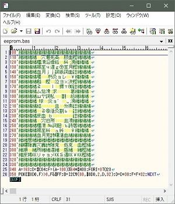  
画像データをI2C接続のEEPREOMに書き込みプログラムソースです.  
実行すると、出力時に指定したプログラム番号領域に画像データを書きこみます.  
EEPROMに書き込んだ画像データの表示を行う場合、次のようなプログラムを実行します.  

```
10 CLS:?"No=";:INPUT A
20 F=(A-100)%64*#400
30 POKE#8D0,F>>8,F&#FF 
40 R=I2CR(#50,#8D0,2,#900,768)
50 IF INKEY()=32 GOTO 10
60 GOTO 50
```

**16進データ**  
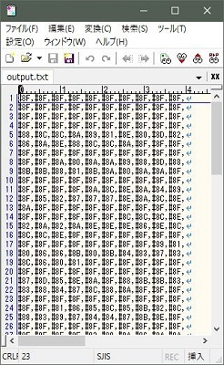  
IchigoJamの16進数形式で出力します.  

**16進データバイナリデータ**  
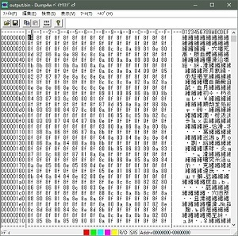  
バイナリ形式の画像データです.  

## 画像ファイルの作成に関する補足説明
###Windows10ペイントツール利用の補足説明
- 画像ファイルのサイズと色数指定
 [ファイル]-[プロパティ]にて[イメージのプロパティ]画面を開きます.  
 単位に[ピクセル]、色に白黒を指定します.  
 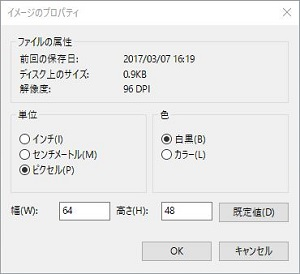

- 形式を指定して保存 
 [ファイル]-[名前を付けて保存]を選択します.  
 [名前を付けて保存]画面にてファイルの種類に[モノクロビットマップ]を指定します.  
 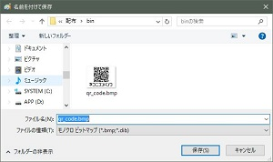  
 

